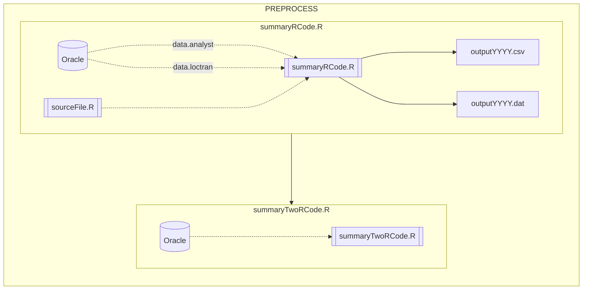

# RESOURCES FOR SEFSC GITHUB USERS 

Welcome to the SEFSC GitHub! Here we will store living documents and information related to facilitating effective GitHub workflows at the SEFSC. 

# NEW USERS 

Remember to review the [SEFSC GitHub SOP](https://github.com/AdyanRios-NOAA/SEFSC-Resources/blob/18a6c7e98b3e9b71f5e5912282d9d7f08c0e0a1a/SEFSC%20GitHub%20SOP%20and%20User%20Agreement%20Form/SEFSC%20Github%20SOP%20-%20RR%20-%20LON%20-%20BGM.pdf), create a GitHub account, and fill out and return the [SEFSC GitHub user agreements](https://github.com/AdyanRios-NOAA/SEFSC-Resources/blob/18a6c7e98b3e9b71f5e5912282d9d7f08c0e0a1a/SEFSC%20GitHub%20SOP%20and%20User%20Agreement%20Form/SEFSC_GitHub_User_Agreement.pdf) form to [James Primrose](james.primrose@noaa.gov). **Note**: You do not have to have the ISSO sign the last spot. 

# Table Example: 

| Column_1                          | Column_2                               | Col_3 | Column_4             |
|-----------------------------------|----------------------------------------|-------|----------------------|
| Content_A.log                     | More info here                         | NO    | ~/some/path/or/url   |
| Content_B.log                     | More info here                         | YES   | ~/some/path/or/url   |
| Content_C.log                     | More info here                         | NO    | ~/some/path/or/url   |

# Mermaid Example: 

# Directory Structure Example: 
### (Your project directory don't need to look like this)
<pre>
Project
   ├── base                  # base for code
   │   ├── bin               # binaries & shell scripts
   │   ├── java              # java source
   │   └── R                 # R source
   ├── env                   # environment data
   ├── logs                  # log files  
   ├── products              # product data directory
   │   ├── data              # final data products
   │   └── html              # html products
   │       ├── css           # css 
   │       └── js            # js
   ├── rawdata               # raw data directory
   │   ├── dat               # raw GPS dat files 
   │   ├── rundata           # non rule-of-three data used for processing
   │   └── csv               # csv data
   ├── resource              # resource directory 
   │   └── jpg               # resource jpg files  
   └── README.md             # intro page that you're reading
   └── RELEASE_NOTES.md      # list of updates to this repo
</pre>
 

# DISCLAMER

This repository is a scientific product and is not official communication of the National Oceanic and Atmospheric Administration, or the United States Department of Commerce. All NOAA GitHub project code is provided on an ‘as is’ basis and the user assumes responsibility for its use. Any claims against the Department of Commerce or Department of Commerce bureaus stemming from the use of this GitHub project will be governed by all applicable Federal law. Any reference to specific commercial products, processes, or services by service mark, trademark, manufacturer, or otherwise, does not constitute or imply their endorsement, recommendation or favoring by the Department of Commerce. The Department of Commerce seal and logo, or the seal and logo of a DOC bureau, shall not be used in any manner to imply endorsement of any commercial product or activity by DOC or the United States Government.
